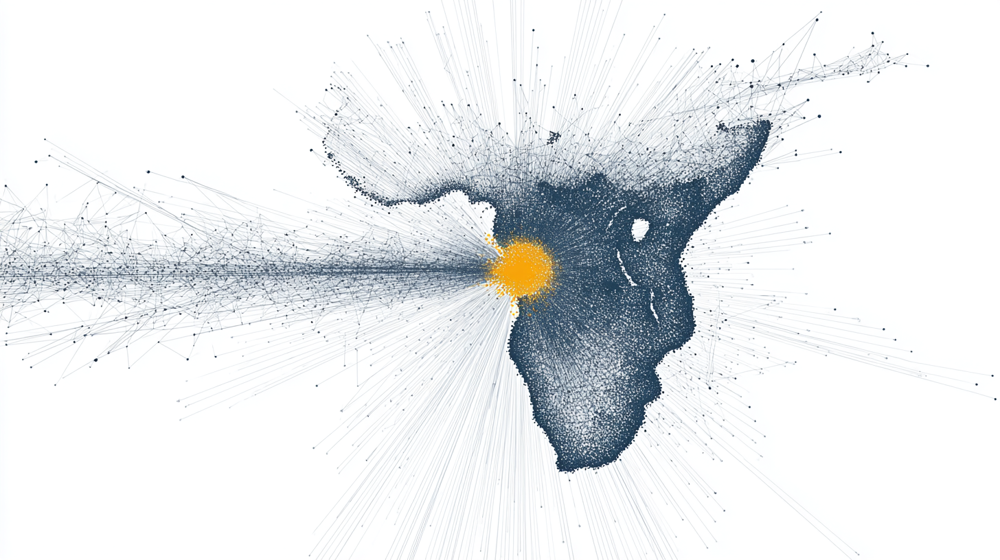

<div align="center">



# Lekker Pay

**One API for South African payments. AI-extensible. MCP-native.**

[](#test-status)
[](#test-status)
[](pyproject.toml)
[](LICENSE)
[](docs/PROVIDER_RECIPE.md)

[**Submission deck (PDF)**](submission/lekker-pay-submission.pdf)  ·  [**Brand kit**](submission/brand/BRAND_KIT.md)  ·  [**Architecture**](docs/ARCHITECTURE.md)  ·  [**Provider recipe**](docs/PROVIDER_RECIPE.md)

</div>

---

## What it is

Lekker Pay is an open-source Python library that unifies South Africa's **60+ fragmented payment providers** — PayFast, Paystack, Ozow, Yoco, Stitch, and the rest — behind one strict-typed API. Two adapters ship today, both production-grade. **One of them was written by IBM Bob.**

The wedge isn't the library. **The wedge is the recipe** — a procedural document that lets IBM Bob (or any agentic coding tool) generate a new conformant adapter, with full test suite, in **hours not weeks**.

This repository is the IBM Bob Hackathon May 2026 submission.

## The 30-second version

```python
from lekker_pay import PaymentRouter, PaymentIntent

router = PaymentRouter(config)
result = await router.create_payment(
    "paystack",
    PaymentIntent(amount_cents=10000, currency="ZAR", reference="ORDER-001"),
)
```

Swap `"paystack"` for `"payfast"` — same code path, different rail. Both adapters honour the same contract, raise from the same error hierarchy, and pass the same five universal footgun regression tests.

## Quick start

```bash
git clone https://github.com/Dellie-Yah/lekker-pay-za.git
cd lekker-pay-za

# Run the full test suite (1 minute)
cd packages/lekker-pay
pip install -e ".[dev]"
pytest --cov=lekker_pay
# → 111 passed · 95.36% coverage

# Or: spin up the merchant API + Postgres + Redis in one command
cd ../..
docker compose up -d
open http://localhost:8000     # the HTML checkout form
```

The merchant API is a real FastAPI service that talks to provider sandboxes end-to-end. A real R100 sandbox payment was processed during the hackathon build weekend — webhook verified, status flipped, idempotent on retry.

## The Bob methodology (the hook)

The Paystack adapter wasn't written by hand. It was generated by **IBM Bob** from three inputs:

1. **The provider's API documentation** — Paystack's public OpenAPI spec.
2. **The reference adapter** — [`packages/lekker-pay/lekker_pay/providers/payfast.py`](packages/lekker-pay/lekker_pay/providers/payfast.py) (721 lines, **98% coverage**).
3. **The recipe** — [`docs/PROVIDER_RECIPE.md`](docs/PROVIDER_RECIPE.md), with 8 critical security rules and 5 universal footgun regression tests.

What Bob returned:

| Output | Lines | Coverage |
|---|---|---|
| [`paystack.py`](packages/lekker-pay/lekker_pay/providers/paystack.py) — the adapter | 683 | **92%** |
| [`test_paystack.py`](packages/lekker-pay/tests/test_paystack.py) — the test suite | 1,002 | — |

One human review pass was needed to widen a `raw` field type in `base.py` to support nested JSON. That was it.

**Anyone with the recipe + a reference adapter can ship a new African provider in hours instead of weeks.** That's the production line behind the library.

The exact prompt is preserved at [`docs/BOB_PROVIDER_PROMPT_TEMPLATE.md`](docs/BOB_PROVIDER_PROMPT_TEMPLATE.md) — copy it verbatim into Bob, fill in the provider placeholders, and watch the same loop run for SnapScan, Stitch, Mukuru, Zapper, or anything else.

## Test status

| Surface | Lines | Coverage |
|---|---|---|
| `providers/payfast.py` | 721 | **98%** |
| `providers/paystack.py` | 683 | **92%** |
| `base.py` · `router.py` · `errors.py` | — | 91–100% |
| **Total project** | — | **95.36%** |
| **Tests** | — | **111 / 111 passing** |

Five universal footgun regression tests run against every adapter:

1. **Constant-time signature comparison** — `hmac.compare_digest`, never `==`.
2. **Integer-cents money handling** — `amount_cents: int`, never `float`.
3. **Raw-bytes webhook verification** — `request.body()` before any JSON parse.
4. **Webhook idempotency** — Redis-keyed on provider event id.
5. **Merchant-reference fidelity** — round-trip preserved end-to-end.

These map directly to PROVIDER_RECIPE.md §§ Critical Security Rules 1–5.

## Architecture

```
┌────────────┐    ┌──────────────┐    ┌────────────────────┐    ┌──────────────┐
│ Customer   │ →  │ Merchant API │ →  │ PaymentRouter      │ →  │ PayFast      │
│ browser    │    │ (FastAPI)    │    │ + BasePaymentAdapter│    │ Paystack     │
└────────────┘    └──────────────┘    └────────────────────┘    │ Ozow (next)  │
                         ↑                                       │ Yoco (next)  │
                         │            ┌────────────────────┐    └──────────────┘
                         └────────────│ verified webhook   │ ←──────────┘
                                      │ → Postgres + Redis │
                                      └────────────────────┘
```

Full diagram and design rationale: [`docs/ARCHITECTURE.md`](docs/ARCHITECTURE.md).

## Repository layout

```
.
├── packages/lekker-pay/        # The library — pip install -e
│   ├── lekker_pay/
│   │   ├── base.py             # BasePaymentAdapter + Pydantic models
│   │   ├── router.py           # PaymentRouter (factory + dispatcher)
│   │   ├── errors.py           # Exception hierarchy
│   │   └── providers/
│   │       ├── payfast.py      # 721 lines · 98% coverage · the reference
│   │       └── paystack.py     # 683 lines · 92% coverage · Bob-generated
│   └── tests/
│       ├── test_payfast.py     # 873 lines
│       ├── test_paystack.py    # 1,002 lines
│       └── test_router.py
│
├── apps/merchant-api/          # FastAPI demo app
│   ├── app/main.py             # /checkout · /webhooks/{provider} · /orders/{ref}
│   ├── app/payment_service.py  # Wires the router into the API
│   └── Dockerfile
│
├── docs/
│   ├── ARCHITECTURE.md
│   ├── PROVIDER_RECIPE.md      # 8 critical rules — the moat
│   ├── PAYFAST_DESIGN_RATIONALE.md
│   ├── BOB_PROVIDER_PROMPT_TEMPLATE.md
│   ├── BOB_PAYSTACK_PROMPT.md  # The exact prompt Bob received
│   ├── STORY.md                # The brand fable
│   └── BUSINESS_STRATEGY.md
│
├── submission/                 # IBM Bob Hackathon submission assets
│   ├── lekker-pay-submission.pdf
│   ├── build-deck.js
│   ├── brand/                  # Logo, cover image, BRAND_KIT.md
│   ├── logo/                   # SVG variants
│   ├── video/                  # Script + demo commands
│   └── lablab/                 # Submission form copy
│
└── compose.yml                 # Postgres + Redis + merchant-api, one command
```

## Tech stack

**Library:** Python 3.12 · Pydantic v2 (strict) · httpx · cryptography · structlog
**Service:** FastAPI · PostgreSQL 16 · Redis 7
**Quality:** pytest + asyncio · pytest-cov · respx · mypy `--strict` · ruff
**Dev:** Docker Compose · Hatch · cloudflared (webhook tunnel)
**Codegen:** IBM Bob · `docs/PROVIDER_RECIPE.md` · `docs/BOB_PROVIDER_PROMPT_TEMPLATE.md`

Every dependency earns its place. There is no leftover scaffolding from yesterday's framework.

## Roadmap

| Quarter | Milestone |
|---|---|
| **Q3 2026** | Hosted SaaS + multi-tenant dashboard + KMS bridge |
| **Q4 2026** | MCP server (the first AI-agent-native payments rail) |
| **Q1 2027** | Adapter marketplace (Sigstore-signed) + pan-African expansion (Nigeria, Kenya) |

See [`docs/BUSINESS_STRATEGY.md`](docs/BUSINESS_STRATEGY.md) for the full play.

## Submission assets

| Asset | Path |
|---|---|
| 15-slide submission deck (PDF) | [`submission/lekker-pay-submission.pdf`](submission/lekker-pay-submission.pdf) |
| Deck generator (deterministic) | [`submission/build-deck.js`](submission/build-deck.js) |
| Brand kit (palette · type · do/don't) | [`submission/brand/BRAND_KIT.md`](submission/brand/BRAND_KIT.md) |
| Hero cover image | [`submission/brand/cover-the-flow.png`](submission/brand/cover-the-flow.png) |
| Logo (SVG, 3 variants) | [`submission/logo/`](submission/logo/) |
| Video script + teleprompter | [`submission/video/TELEPROMPTER.md`](submission/video/TELEPROMPTER.md) |
| Demo command sheet | [`submission/video/DEMO_COMMANDS.md`](submission/video/DEMO_COMMANDS.md) |
| lablab.ai submission copy | [`submission/lablab/SUBMISSION_FORM.md`](submission/lablab/SUBMISSION_FORM.md) |

## The thesis, in one sentence

> *Africa has stations. We laid the railway.*

## Licence + maintainer

MIT licensed — see [`LICENSE`](LICENSE).

Built by **Delron Claassen** (`LimpingXpert`) in Cape Town · `delronclaassen@gmail.com`

Built with **IBM Bob**. Built for Africa. Built to last.
