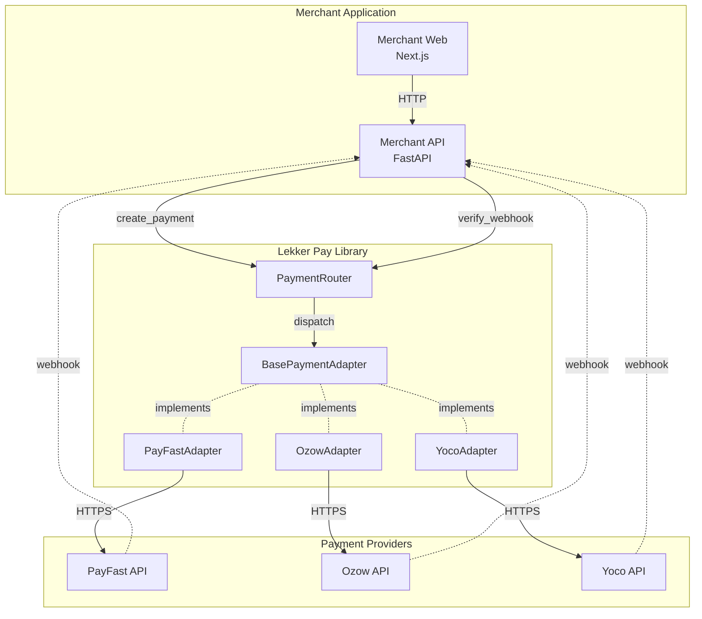

# Lekker Pay Architecture

## Overview

Lekker Pay is a unified payment adapter library that provides a single interface for integrating with multiple South African payment providers. The architecture is designed around three core principles:

1. **Provider Agnosticism** - One interface, multiple providers
2. **Type Safety** - Strict typing with Pydantic v2 and mypy
3. **Security First** - Constant-time signature verification, no float money

## System Architecture



## Core Components

### 1. BasePaymentAdapter (Abstract Base Class)

The contract that all provider adapters must implement:

```python
class BasePaymentAdapter(ABC):
    provider_name: ClassVar[str]
    
    async def create_payment(self, intent: PaymentIntent) -> PaymentResult
    async def get_status(self, provider_payment_id: str) -> PaymentStatus
    def verify_webhook(self, headers: Mapping[str,str], body: bytes) -> WebhookEvent
    async def refund(self, provider_payment_id: str, amount_cents: int | None) -> PaymentResult
```

**Key Design Decisions:**

- **Stateless**: Config injected via constructor, no environment reads
- **Async by default**: All I/O operations are async (except webhook verification)
- **Sync webhook verification**: Cryptographic operations don't need async, keeps testing simple
- **Money as integers**: `amount_cents` is always `int`, never `float`

### 2. PaymentRouter (Factory & Dispatcher)

Manages provider registration and dispatches requests to the appropriate adapter:

```python
router = PaymentRouter(provider_configs)
router.register_adapter("payfast", PayFastAdapter)
result = await router.create_payment("payfast", intent)
```

**Responsibilities:**
- Lazy adapter instantiation (created on first use)
- Provider validation (registered + configured)
- Unified error handling

### 3. Pydantic Models

All data structures use Pydantic v2 with strict mode:

- **PaymentIntent**: Provider-agnostic payment request
- **PaymentResult**: Unified payment response
- **WebhookEvent**: Verified webhook payload
- **ProviderConfig**: Provider credentials and settings

**Type Safety Rules:**
- No `Any` types in public interfaces
- All models use `strict=True`
- `HttpUrl` for URLs, `EmailStr` for emails
- Enums for status values

### 4. Error Hierarchy

```
LekkerPayError (base)
└── ProviderError
    ├── AuthenticationError
    ├── InvalidRequestError
    ├── NetworkError
    ├── SignatureMismatchError
    ├── RateLimitError
    ├── PaymentNotFoundError
    └── RefundError
```

**Error Handling Contract:**
- Adapters catch all provider-specific exceptions
- Re-raise as appropriate `LekkerPayError` subclass
- Never let raw `httpx.HTTPError` escape adapter boundary

## Provider Adapter Pattern

Each provider adapter follows this structure:

```python
class ProviderAdapter(BasePaymentAdapter):
    provider_name = "provider"
    
    def __init__(self, config: ProviderConfig) -> None:
        self.config = config
        self.client = httpx.AsyncClient(
            base_url=self._get_base_url(),
            timeout=30.0
        )
    
    def _get_base_url(self) -> str:
        """Return sandbox or production URL based on config."""
        if self.config.sandbox:
            return "https://sandbox.provider.com"
        return "https://api.provider.com"
    
    async def create_payment(self, intent: PaymentIntent) -> PaymentResult:
        try:
            # 1. Build provider-specific request
            # 2. Sign/authenticate request
            # 3. Make HTTP call
            # 4. Parse response
            # 5. Map to PaymentResult
            pass
        except httpx.HTTPError as e:
            raise NetworkError(str(e), provider=self.provider_name)
    
    def verify_webhook(self, headers: Mapping[str,str], body: bytes) -> WebhookEvent:
        # 1. Extract signature from headers/body
        # 2. Compute expected signature
        # 3. Compare using hmac.compare_digest (NEVER ==)
        # 4. Parse and return WebhookEvent
        pass
```

## Security Considerations

### 1. Webhook Signature Verification

**CRITICAL**: Always use constant-time comparison:

```python
import hmac

# ✅ CORRECT
if not hmac.compare_digest(expected_sig, received_sig):
    raise SignatureMismatchError("Invalid signature")

# ❌ WRONG - timing attack vulnerability
if expected_sig != received_sig:
    raise SignatureMismatchError("Invalid signature")
```

### 2. Money Handling

**CRITICAL**: Never use floats for money:

```python
# ✅ CORRECT
amount_cents = 10000  # R100.00

# ❌ WRONG
amount_rands = 100.00  # floating point precision issues
```

### 3. Raw Webhook Bodies

For HMAC verification, the body must be raw bytes:

```python
# ✅ CORRECT
@app.post("/webhooks/payment")
async def webhook(request: Request):
    body = await request.body()  # Raw bytes
    event = adapter.verify_webhook(request.headers, body)

# ❌ WRONG
@app.post("/webhooks/payment")
async def webhook(payload: dict):
    # Body already parsed - signature verification will fail
```

## Testing Strategy

### Unit Tests (respx mocks)

```python
import respx
from httpx import Response

@respx.mock
async def test_create_payment(sample_intent):
    respx.post("https://sandbox.provider.com/payments").mock(
        return_value=Response(200, json={"id": "123", "status": "pending"})
    )
    
    adapter = ProviderAdapter(config)
    result = await adapter.create_payment(sample_intent)
    
    assert result.provider_payment_id == "123"
    assert result.status == PaymentStatus.PENDING
```

### Integration Tests (optional, env-gated)

```python
@pytest.mark.skipif(not os.getenv("RUN_INTEGRATION_TESTS"), reason="Integration tests disabled")
async def test_create_payment_live():
    # Use real sandbox API
    pass
```

## Deployment Architecture

### Development
```
docker-compose up
├── postgres:16
├── redis:7
└── merchant-api (FastAPI)
```

### Production (conceptual)
```
Vercel (merchant-web)
    ↓
Railway/Render (merchant-api)
    ↓
Managed Postgres + Redis
```

## Extension Points

### Adding a New Provider

1. Create `lekker_pay/providers/newprovider.py`
2. Implement `BasePaymentAdapter`
3. Add tests in `tests/providers/test_newprovider.py`
4. Register in router: `router.register_adapter("newprovider", NewProviderAdapter)`
5. Document in `docs/providers/newprovider.md`

See `docs/PROVIDER_RECIPE.md` for detailed instructions.

## Performance Considerations

- **Connection pooling**: httpx.AsyncClient reuses connections
- **Timeouts**: 30s default, configurable per provider
- **Retries**: Not implemented in v1 (merchant-api layer responsibility)
- **Rate limiting**: Providers may rate limit; adapters raise `RateLimitError`

## Observability

### Structured Logging (structlog)

```python
import structlog

logger = structlog.get_logger()

logger.info(
    "payment_created",
    provider="payfast",
    reference="ORDER-123",
    amount_cents=10000,
    correlation_id=correlation_id
)
```

### Metrics (future)

- Payment creation latency by provider
- Webhook verification success/failure rate
- Provider error rates

## Compliance & Standards

- **PCI DSS**: Library never handles card data directly
- **POPIA**: No PII stored in library (merchant-api responsibility)
- **Idempotency**: Enforced at merchant-api layer via Redis
- **Webhook replay protection**: 24hr TTL in Redis

## References

- [PayFast API Docs](https://developers.payfast.co.za/)
- [Ozow API Docs](https://docs.ozow.com/)
- [Yoco API Docs](https://developer.yoco.com/)